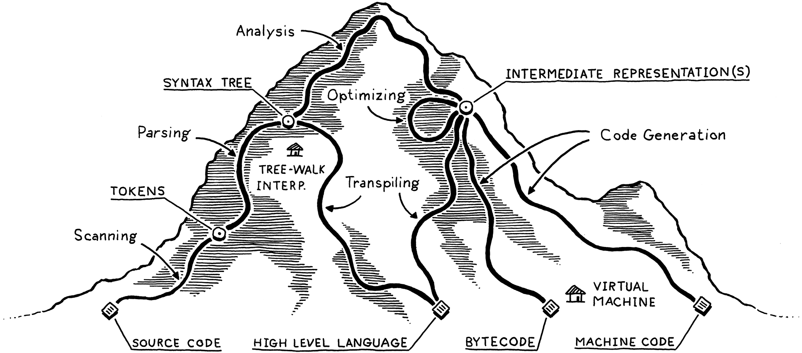

## Lox
A Lox implementation from the book [Crafting Interpreters](https://craftinginterpreters.com).

## Chapters
- [x] 1. Introduction September 7th, 2020
- [x] 2. A Map of the Territory September 8th, 2020
- [x] 3. The Lox Language September 9th, 2020
- [x] 4. Scanning September 10th, 2020
- [x] 5. Representing Code September 11th, 2020
- [x] 6. Parsing Expressions September 12th, 2020
- [x] 7. Evaluating Expressions September 12th, 2020
- [ ] 8. Statements and State
- [ ] 9. Control Flow
- [ ] 10. Functions
- [ ] 11. Resolving and Binding
- [ ] 12. Classes
- [ ] 13. Inheritance
- [ ] 14. Chunks of Bytecode
- [ ] 15. A Virtual Machine
- [ ] 16. Scanning on Demand
- [ ] 17. Compiling Expressions
- [ ] 18. Types of Values
- [ ] 19. Strings
- [ ] 20. Hash Tables
- [ ] 21. Global Variables
- [ ] 22. Local Variables
- [ ] 23. Jumping Back and Forth
- [ ] 24. Calls and Functions
- [ ] 25. Closures
- [ ] 26. Garbage Collection
- [ ] 27. Classes and Instances
- [ ] 28. Methods and Initializers
- [ ] 29. Superclasses
- [ ] 30. Optimization
